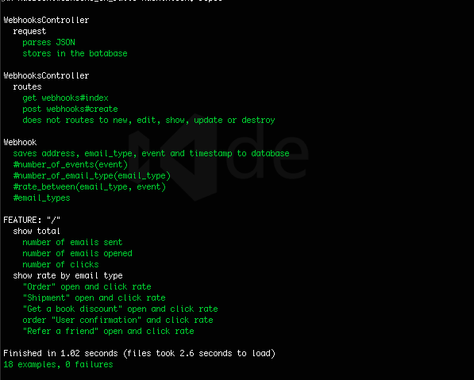

[](https://travis-ci.org/srMarquinho/webhooks_on_rails)
[](https://coveralls.io/github/srMarquinho/webhooks_on_rails?branch=master)

# Web hook on Rails
This little Ruby on Rails app is able to store web hooks into its database and show you the statistics.

Why Rails? It is easy to expand features and fast to build. It's database is postgresql for easy Heroku implementation.

I considered separating concerns and avoiding dependencies. That way new email types and events can be added/removed with easy.

Clean code.

## How to use:
Using terminal:
- Clone this repository `git clone https://github.com/srMarquinho/webhooks_on_rails`
- Navigate to the repo directory `cd webwebhooks_on_rails`
- Install dependencies `bundle install`
- Run `rake db:create` and `rake db:migrate`
- Run the server `rails s`
- Run the webhook simulator `go run doc/llirdnam-master/llirdnam/llirdnam.go http://localhost:3000`
- Visit <http://localhost:3000/>
- Refresh the page to see real-time magic updating the view.

#### See Tests:
- Run `rspec`

#### User stories:

```
As an administrator
So I know users behaviour
I want to see the number of emails sent, opened and clicked
```
```
As an administrator
So I know what kind of behaviour
I want to see the rating by email type
```

#### Where to:
Implement live updates to the browser, possibly with jQuery.
Improve user experience adding views options.

#### Challenges:
This exercise was quite challenging in a few aspects.

Setting up llirdnam web hook environment and requesting it to the server took me quite some time and research. Testing the controller request was also a bit tricky.



